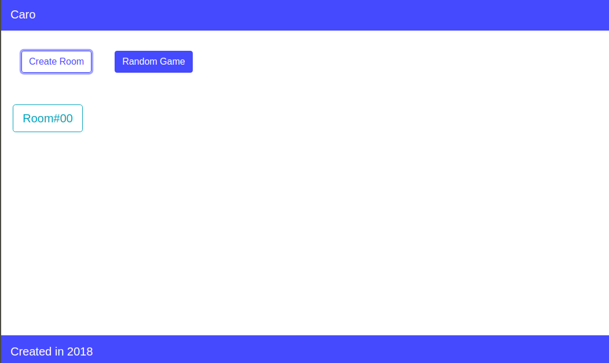
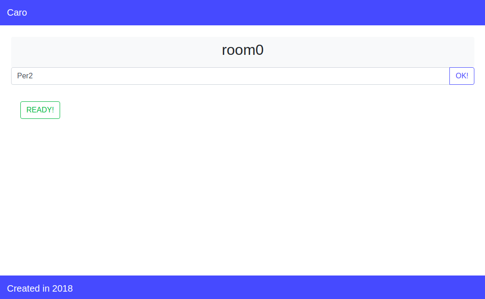
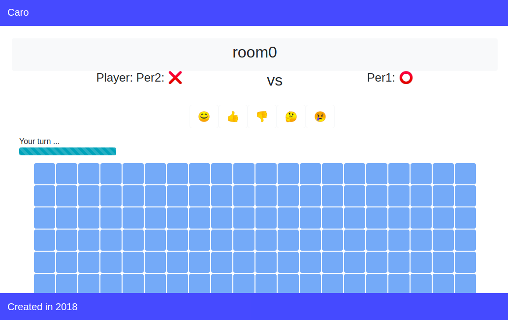
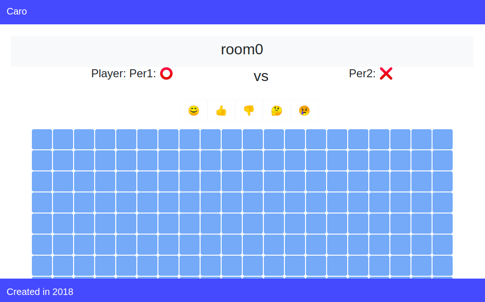
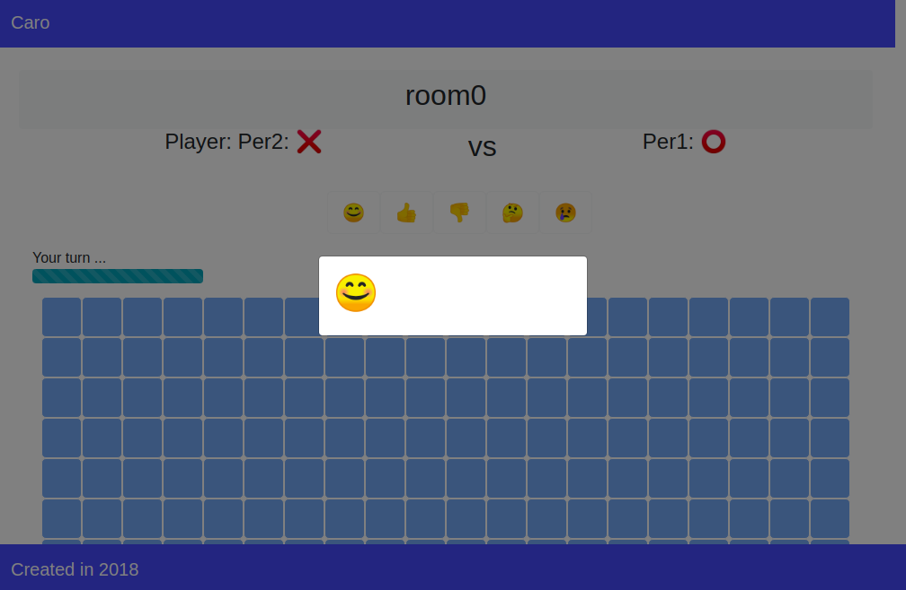
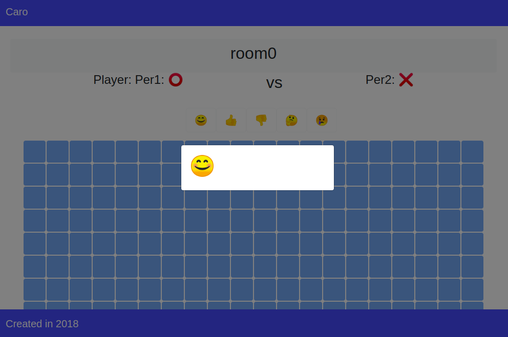
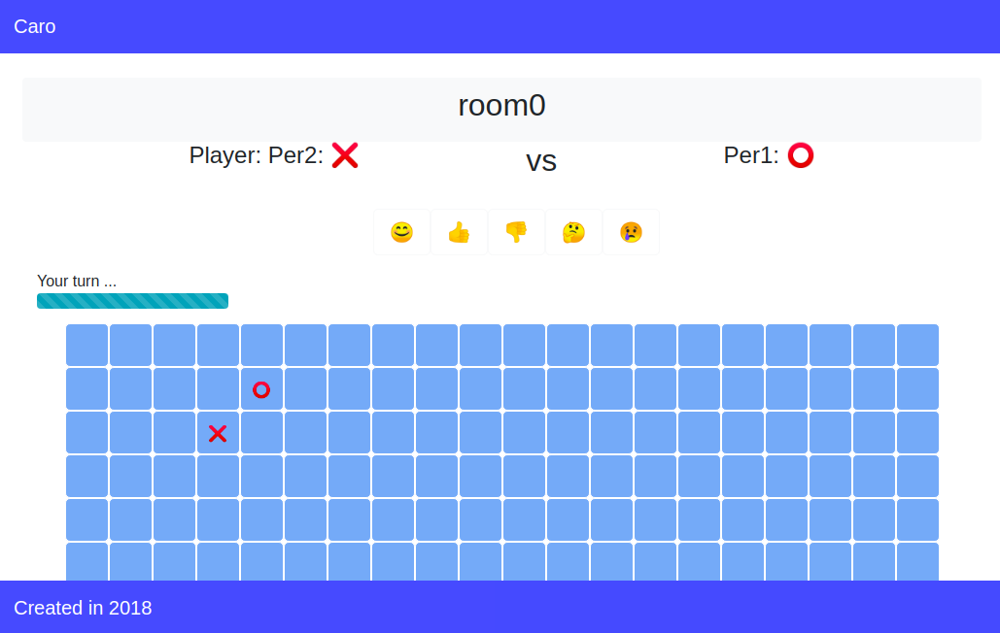
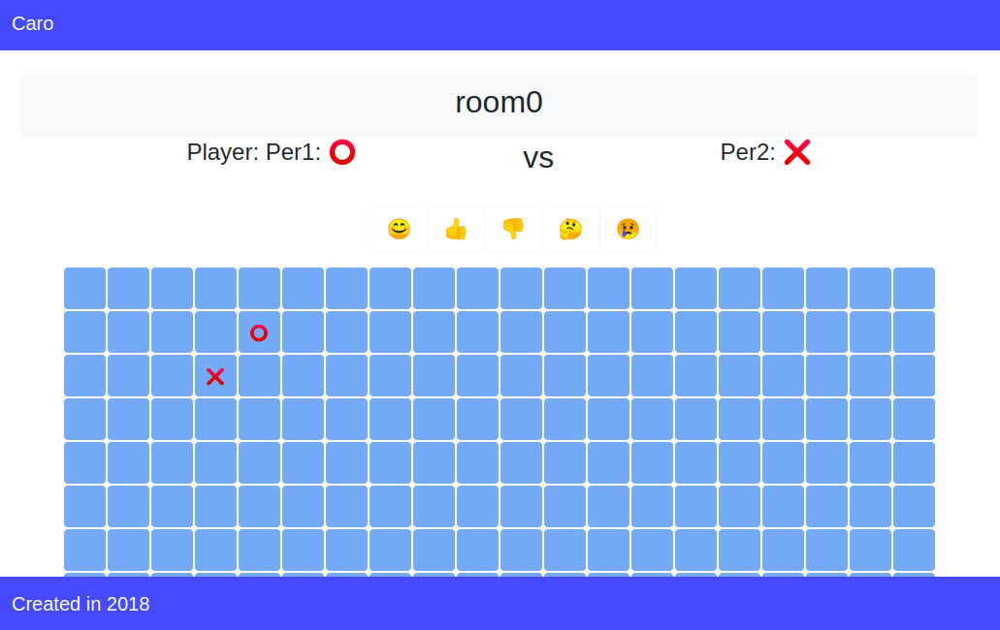
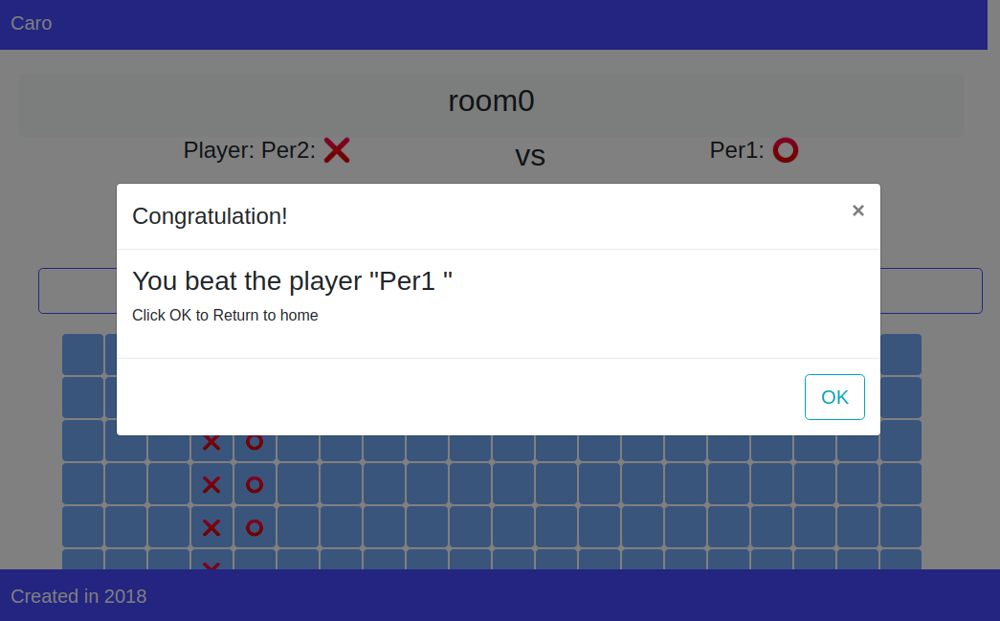
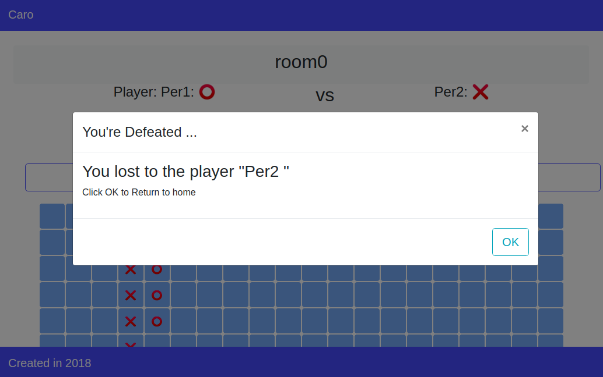

# Game Caro

## Server

- Server uses Nodejs, express, socket.io support to connect with the client.
- The server processes the logic of the game, temporarily storing the basic information.
- Run Server:

```sh
cd Server
npm install
node app.js
```

## Client

- Client uses React, socket.io for handling connections.
- Run Client:

```sh
cd Client
npm install
npm start
```

## Demo

   |  
:---------------: | :---------------:
   |  
 | 
   |  
   |  
